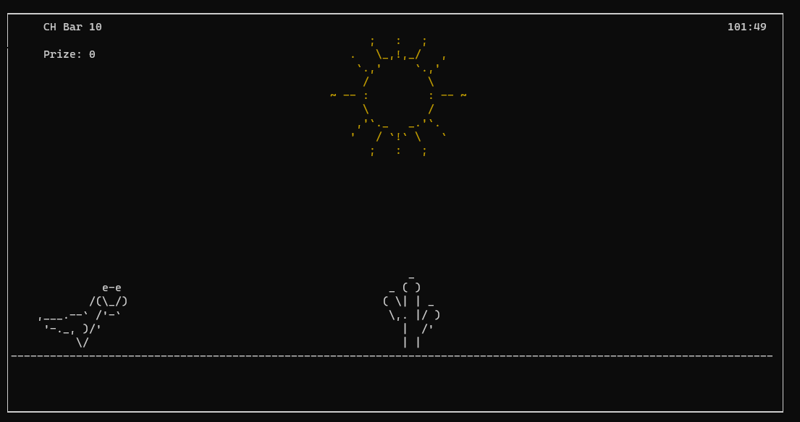

# Chrome Dinosaur
#### Google Chrome dinosaur game using Ncurses in C (T-Rex)

#### DISCLAIMER

This is a fork of the original work by farbodahm (Farbod Ahmadian), to which i am extremely grateful.
This repository has been created for educational purposes only.

##### Commands

You can jump using 'Space' Key, and you can fire when "arrow" was equal to 1 using 'k' Key.

##### To compile and run:

Under many linux distros or cygwin:
(Make sure you have Ncurses library installed!)

```shell
gcc main.c -lncurses -o main.out
./main.out
```




